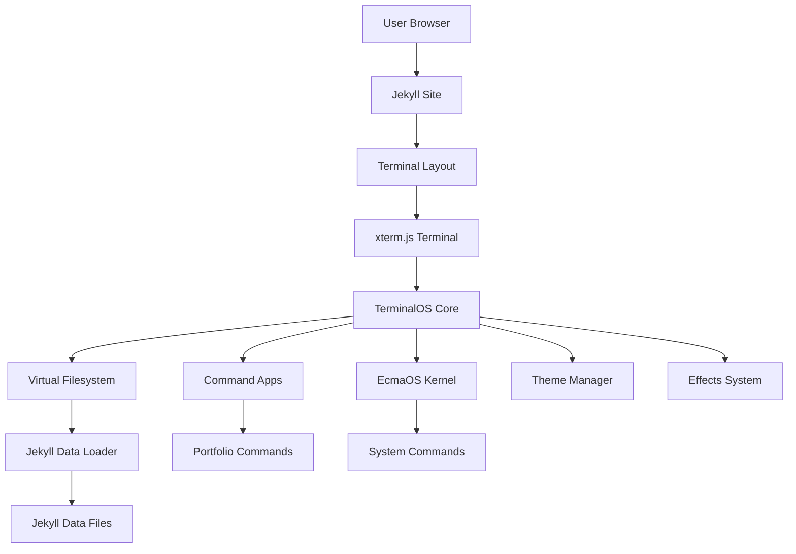

# Architecture Overview

## System Architecture

The Terminal OS Portfolio is built on a modular architecture combining Jekyll static site generation with a client-side terminal emulator.

## Core Components

### Terminal Engine
- **xterm.js**: Full-featured terminal emulator with addons
- **Addons**: Fit, WebLinks, Search, Unicode11, Serialize, Image
- **Rendering**: WebGL/Canvas for high performance

### TerminalOS Core
- **Location**: `assets/js/terminal/core.js`
- **Responsibilities**: Command routing, history, tab completion, EcmaOS integration
- **State Management**: Current path, user, root access, session tracking

### Virtual Filesystem
- **Location**: `assets/js/terminal/filesystem.js`
- **Features**: Directory navigation, file operations, Jekyll data integration
- **Data Source**: Jekyll YAML/JSON files loaded via `filesystem-loader.js`

### Command System
- **Structure**: Modular apps in `assets/js/terminal/apps/`
- **Registration**: Commands registered in `core.js` switch statement and `appMap`
- **Delegation**: Standard Unix commands delegate to EcmaOS kernel

### EcmaOS Integration
- **Loading**: Dynamic ES module import
- **Fallback**: Commands fall through to EcmaOS if not found locally
- **Kernel**: Full operating system kernel with file operations, games, utilities

## Data Flow

1. **Build Time**: Jekyll plugins generate data files from various sources
2. **Page Load**: Jekyll data injected into `window.JEKYLL_DATA`
3. **Terminal Init**: Filesystem loader populates virtual filesystem
4. **Command Execution**: User input → Command router → App execution → Terminal output

## Technology Stack

- **Frontend**: HTML5, CSS3, JavaScript (ES6+)
- **Terminal**: xterm.js 5.3.0
- **Site Generator**: Jekyll with Minimal Mistakes theme
- **Hosting**: GitHub Pages
- **Build**: Ruby/Bundler for Jekyll plugins

## Design Principles

1. **Modularity**: Each command is a separate, testable module
2. **Separation of Concerns**: Core, filesystem, apps, themes are independent
3. **Progressive Enhancement**: Works without EcmaOS, enhanced with it
4. **Error Handling**: Graceful degradation at all levels
5. **Performance**: Lazy loading, efficient rendering, optimized assets

