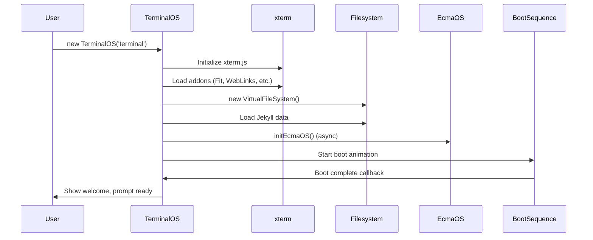

# Terminal System Architecture

## TerminalOS Class

The main terminal controller class manages all terminal operations.

### Initialization Flow

### Command Execution Flow

1. User types command
2. `handleCommand()` parses input
3. Switch statement routes to handler
4. Local app or EcmaOS delegation
5. Output written to terminal
6. Prompt refreshed

### State Management

- **currentPath**: Current working directory
- **currentUser**: Active user (guest/root)
- **isRoot**: Root access flag
- **commandHistory**: Command history array
- **sessionStartTime**: Uptime calculation

## xterm.js Integration

### Addons Loaded

- **FitAddon**: Auto-resize terminal to container
- **WebLinksAddon**: Clickable URLs
- **SearchAddon**: Terminal content search (Ctrl+F)
- **Unicode11Addon**: Enhanced Unicode support
- **SerializeAddon**: Terminal state serialization
- **ImageAddon**: Image display support
- **WebglAddon/CanvasAddon**: High-performance rendering

### Terminal Configuration

- Font: Monaco, Menlo, Ubuntu Mono
- Font size: 12px mobile, 14px desktop
- Scrollback: 1000 lines
- Theme: Matrix green (default)

## Input Handling

### Key Events

- **Enter**: Execute command
- **Backspace**: Delete character
- **Arrow Up/Down**: Command history
- **Tab**: Command/file completion
- **Ctrl+F**: Search terminal content

### Tab Completion

1. Parse input to get command/argument
2. If command: match against command list
3. If argument: match against filesystem listing
4. Show matches or complete if unique

## Boot Sequence

Simulated computer boot process:

1. **BIOS**: POST checks, hardware detection
2. **Boot Loader**: GRUB-style interface
3. **Kernel**: Loading animation
4. **Init**: Service startup
5. **Ready**: Welcome message, prompt

Press ESC to skip boot sequence.

